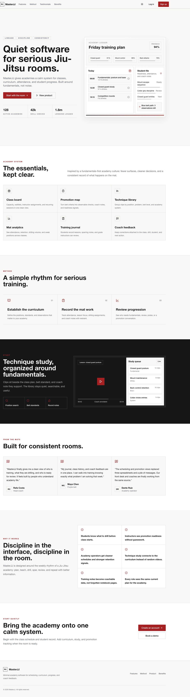
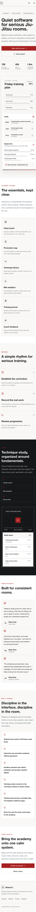

# MasterJJ

MasterJJ is minimal Brazilian Jiu-Jitsu academy software for class scheduling,
curriculum, student progress, promotion readiness, and coach feedback. The
visual direction is restrained and greyscale-led: calm surfaces, sparse
typography, and small red accents for important actions.

## App Preview





## Highlights

- **Minimal academy ledger**: View classes, attendance, capacity, and
  instructor priorities without dashboard noise.
- **Promotion readiness**: Track belt criteria, skill coverage, and student
  readiness signals instead of relying on scattered notes.
- **Technique study**: Organize clips by position, belt level, class, and
  assignment so video supports the curriculum.
- **Training journals**: Give students a place to record lessons, sparring
  notes, and goals that coaches can review.
- **Role-aware workflows**: Support students, instructors, and admins with
  local demo authentication and dashboard surfaces.
- **Responsive UI**: Includes refreshed desktop and mobile screenshots captured
  from the actual app.

## Tech Stack

- Next.js 16 with the App Router
- TypeScript
- Tailwind CSS
- Radix UI components
- Local demo auth state for preview deployments
- Recharts for dashboard analytics
- Lucide icons

## Getting Started

1. Install dependencies:

   ```bash
   npm install
   ```

2. Start the development server:

   ```bash
   npm run dev
   ```

3. Open `http://localhost:3000`.

## Verification

Use these commands before shipping changes:

```bash
npm run type-check
npm run build
```

The app does not require external service credentials for local or Vercel
preview builds.

## Screenshot Refresh

The README images live in `public/images/`.

To refresh them, run the app locally and capture:

```bash
playwright screenshot --full-page --viewport-size=1440,1100 http://127.0.0.1:3000 public/images/masterjj-home-desktop.png
playwright screenshot --full-page --viewport-size=390,1200 http://127.0.0.1:3000 public/images/masterjj-home-mobile.png
```
